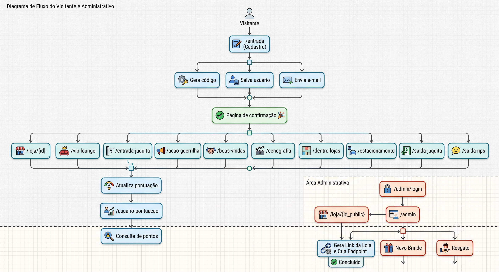

# 🎟️ Client Journey


Sistema desenvolvido para o **Exagerado**, maior evento outlet do Brasil, com o objetivo de substituir o Google Forms utilizado há mais de 14 anos por uma plataforma própria de cadastro, coleta de dados e gamificação da experiência do visitante.

Além de tornar a coleta de dados mais confiável e escalável, o sistema aumenta significativamente a quantidade e a qualidade das informações disponíveis para estudos demográficos e análises de comportamento dos consumidores.

---

# 📖 Sobre o projeto

O **Client Journey** nasceu para resolver um problema recorrente dos eventos: a baixa adesão ao preenchimento de pesquisas e a limitação do processo baseado em formulários tradicionais.

A solução transforma a coleta de dados em uma experiência gamificada, oferecendo benefícios reais ao visitante enquanto gera informações de maior qualidade para o negócio.

O projeto foi **arquitetado, projetado e desenvolvido integralmente por uma única pessoa**, desde o banco de dados até a interface, APIs e integrações externas.

---

# 🎯 Objetivos

- Substituir o Google Forms utilizado durante mais de 14 anos;
- Aumentar a confiabilidade da base de clientes;
- Expandir a amostra utilizada em estudos demográficos;
- Incentivar o preenchimento de pesquisas através de recompensas;
- Centralizar toda a jornada do visitante em uma única plataforma.

---

# 🚀 Funcionalidades

## 👤 Cadastro de visitantes

- Cadastro via formulário web;
- Geração automática de um identificador único;
- Envio automático do ID por e-mail;
- Armazenamento seguro dos dados.

---

## 🎁 Sistema de gamificação

O visitante recebe um **ID único**, utilizado durante todo o evento.

Com esse ID é possível:

- acumular pontos realizando compras nas lojas participantes;
- responder pesquisas espalhadas pelo evento;
- consultar a pontuação;
- trocar pontos por brindes.

A coleta de dados acontece de forma natural durante a participação do visitante, tornando a pesquisa muito mais atrativa.

---

## 🛍️ Área administrativa

A plataforma também possui um painel administrativo responsável pelo gerenciamento da campanha.

Entre as funcionalidades estão:

- gerenciamento de lojas parceiras;
- cadastro de brindes;
- controle de resgates;
- autenticação administrativa.

---

# 🏗 Arquitetura

## Front-end

- HTML5
- Bootstrap 5

## Back-end

- Python
- FastAPI

## Banco de dados

- PostgreSQL
- Supabase

## Integrações

- API Transacional E-goi (envio automático de e-mails)

---

# 🔄 Fluxo da aplicação



---

# 🔐 Área administrativa

```text
/admin/login
      │
      ▼
   Painel Admin
      │
 ┌────┼───────────────┐
 │    │               │
 ▼    ▼               ▼
Lojas  Brindes     Resgates
```

---

# 📂 Estrutura simplificada

```text
client_journey/

├── app/
│   ├── routers/
│   ├── services/
│   ├── templates/
│   ├── static/
│   ├── database.py
│   └── main.py
│
├── requirements.txt
├── README.md
└── .env
```

---

# 💡 Tecnologias

| Tecnologia | Utilização |
|------------|------------|
| FastAPI | API e Backend |
| PostgreSQL | Banco de dados |
| Supabase | Infraestrutura do banco |
| Bootstrap | Interface |
| HTML | Front-end |
| E-goi API | Envio de e-mails transacionais |

---

# ✉ Integração com E-goi

Após o cadastro do visitante:

1. é gerado um ID único;
2. o usuário é salvo no banco;
3. um e-mail é enviado automaticamente contendo seu identificador.

Esse identificador é utilizado durante toda a experiência do evento para:

- responder pesquisas;
- registrar compras;
- acumular pontos;
- realizar resgates.

---

# 📈 Impacto

O projeto substituiu um processo manual baseado em Google Forms por uma plataforma integrada capaz de unir:

- cadastro de visitantes;
- pesquisas demográficas;
- gamificação;
- fidelização;
- controle de brindes;
- administração das campanhas.

Além do ganho operacional, a solução elimina custos recorrentes de plataformas terceirizadas e fornece uma base de dados muito mais rica para análises futuras.

Um sistema semelhante chegou a ser orçado em aproximadamente **R$ 40.000,00**. A solução desenvolvida possui como principal custo operacional apenas os créditos da API transacional da E-goi para envio de e-mails.

---

# 👨‍💻 Autor

**Kauã Dias**

Estudante de Estatística — Universidade Federal do Espírito Santo (UFES)

GitHub:  
https://github.com/kauadp

LinkedIn:  
https://linkedin.com/in/kauad

---

## 📄 Licença

Projeto desenvolvido para uso interno do **Exagerado**.